<div align="center">


# 🛒 Retail Consumer Intelligence & Business Analytics Platform

### *"How can a retail company use customer, transaction, product, store, and sales data to increase revenue, improve retention, and optimize inventory?"*

<br/>

| 📊 200,000 Transactions | 👥 50,000 Customers | 📦 5,000 Products | 🏪 200 Stores | 📅 2021–2024 |
|:---:|:---:|:---:|:---:|:---:|

</div>

---

## 📌 Table of Contents
- [Key Findings](#-key-business-findings)
- [📈 Sales Charts](#-sales-analysis)
- [👥 Customer Charts](#-customer-analysis)
- [📦 Product Charts](#-product-analysis)
- [🏪 Store Charts](#-store--geography)
- [📣 Marketing Charts](#-marketing-analysis)
- [Architecture](#-architecture)
- [Tech Stack](#-tech-stack)
- [Project Structure](#-project-structure)
- [Setup](#-quick-setup)

---

## 📈 Key Business Findings

<div align="center">

| KPI | Value | Insight |
|:---|:---:|:---|
| 💰 **Total Revenue** | ₹873 Cr | Stable YoY growth 2021→2024 |
| 📦 **Total Orders** | 2,00,000 | ~54K orders/year |
| 🧾 **Avg Order Value** | ₹43,659 | High-ticket mix |
| 👥 **Unique Customers** | 46,981 | 84.3% are repeat buyers |
| 🔁 **Repeat Rate** | **84.3%** | Very strong loyalty |
| 🏆 **Top Category** | Groceries | ₹143.8 Cr |
| ⚠️ **At Risk Customers** | 24,447 | ₹593 Cr revenue at risk |

</div>

---

## 📈 Sales Analysis

> Monthly revenue trends, annual performance, and day-of-week patterns

<div align="center">

| Monthly Revenue Trend | Annual Revenue |
|:---:|:---:|
| 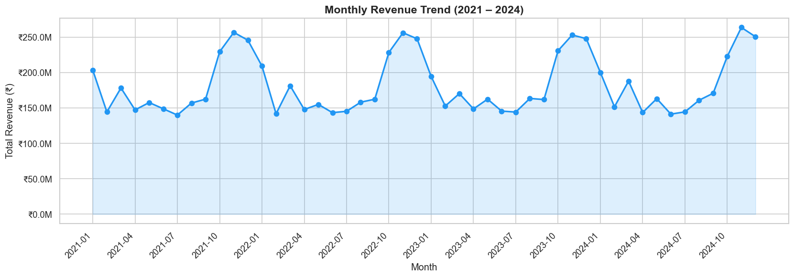 | 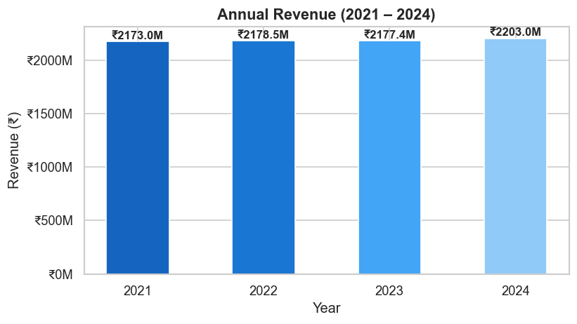 |

| Revenue by Day of Week |
|:---:|
| 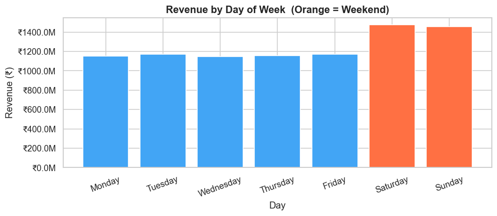 |

</div>

---

## 👥 Customer Analysis

> Who are the customers — age, gender, income, and spending patterns

<div align="center">

| Age Distribution | Gender Split |
|:---:|:---:|
| 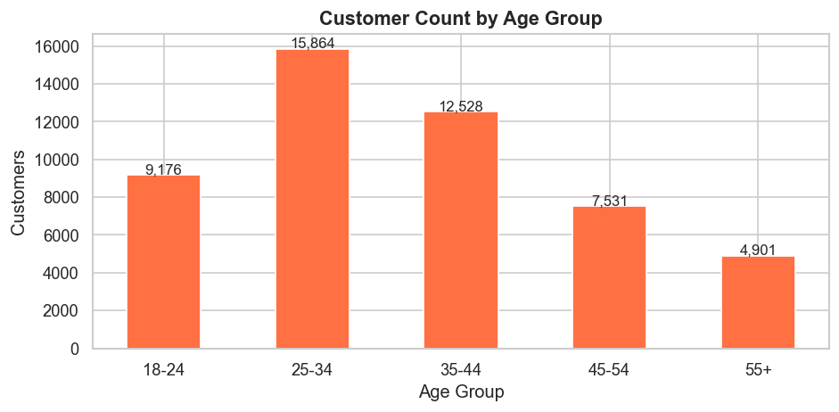 | 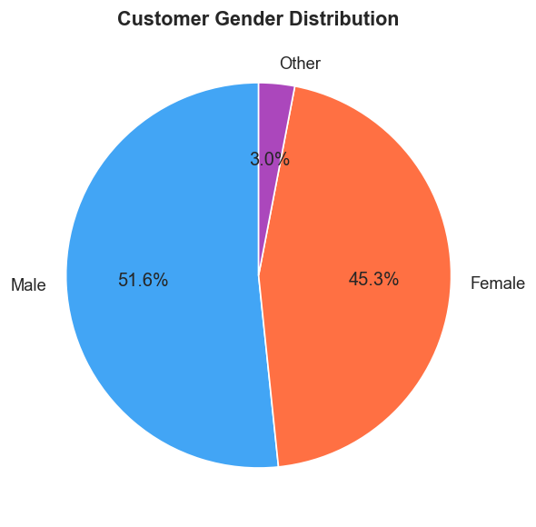 |

| Revenue by Income Segment | Revenue by Age Group |
|:---:|:---:|
| 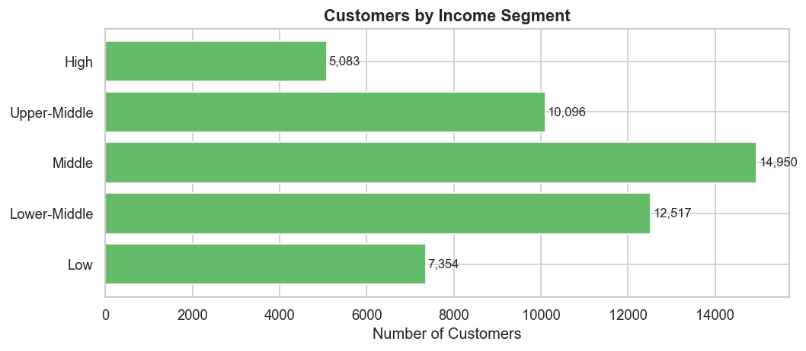 | 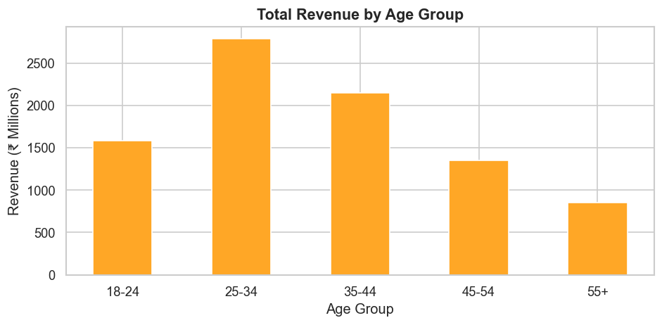 |

</div>

---

## 📦 Product Analysis

> Category revenue, margins, and top-performing products

<div align="center">

| Revenue by Category | Profit Margin by Category |
|:---:|:---:|
| 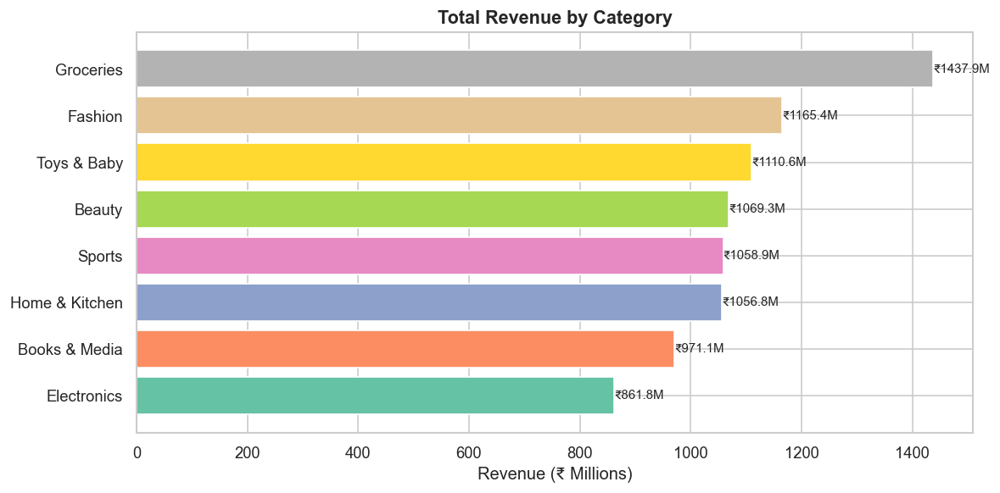 | 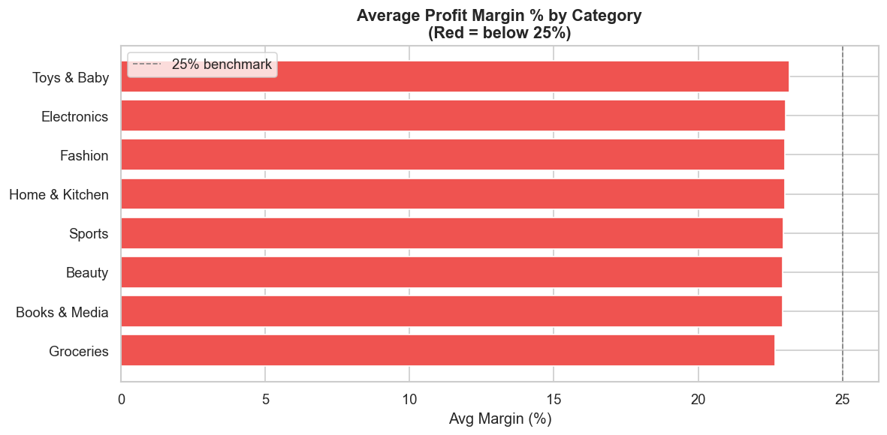 |

| Top 10 Products | Top 10 Brands |
|:---:|:---:|
| 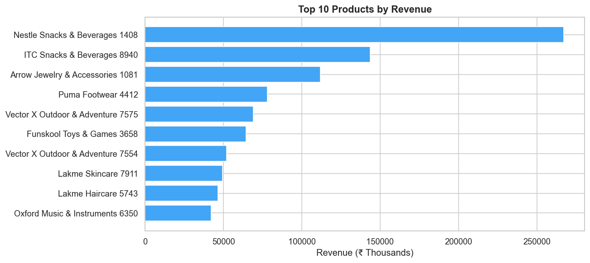 | 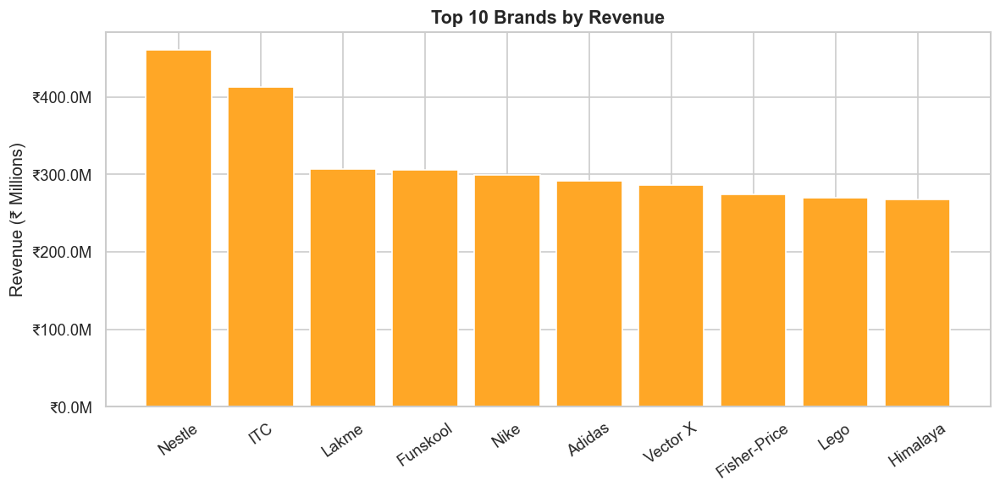 |

</div>

---

## 🏪 Store & Geography

> Regional performance, store types, and top-ranked stores

<div align="center">

| Revenue by Region | Revenue by Store Type |
|:---:|:---:|
| 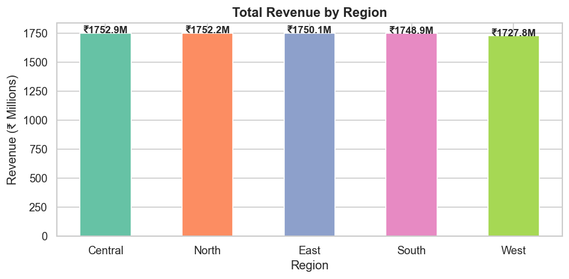 | 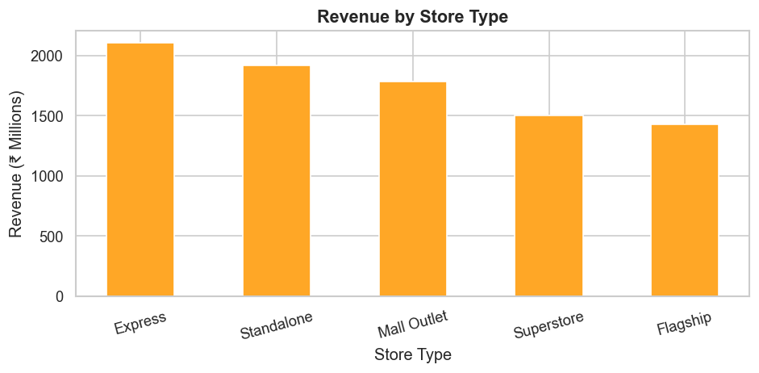 |

| Top 10 Stores by Revenue |
|:---:|
| 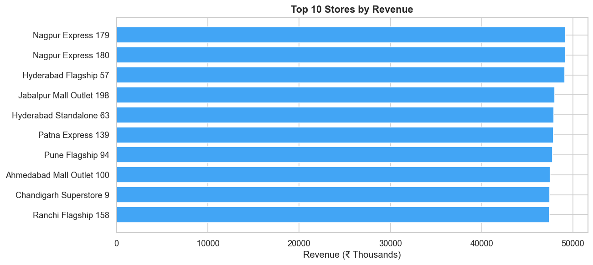 |

</div>

---

## 📦 Inventory Analysis

> Average stock levels by category

<div align="center">

| Avg Closing Stock by Category |
|:---:|
| 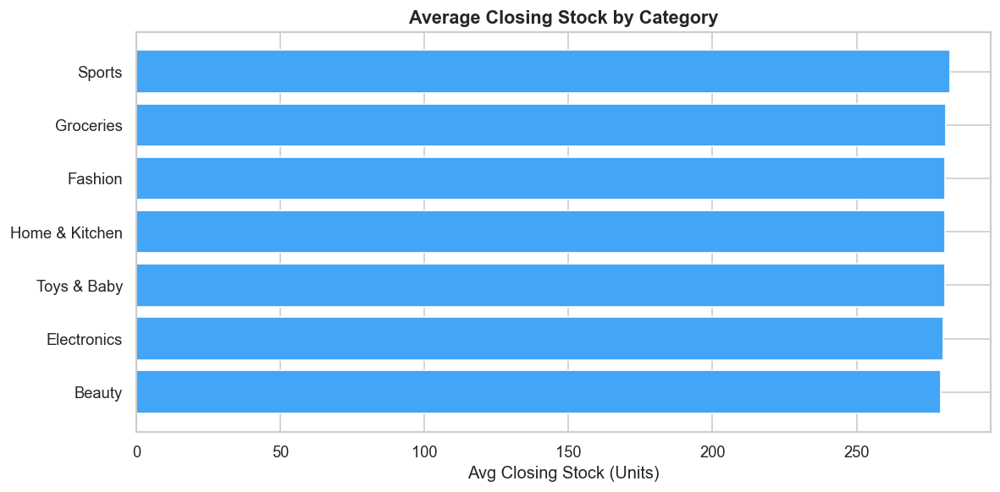 |

</div>

---

## 📣 Marketing Analysis

> Campaign response rates, channel comparison, and campaign rankings

<div align="center">

| Response Rate by Channel | Contacts vs Responses |
|:---:|:---:|
| 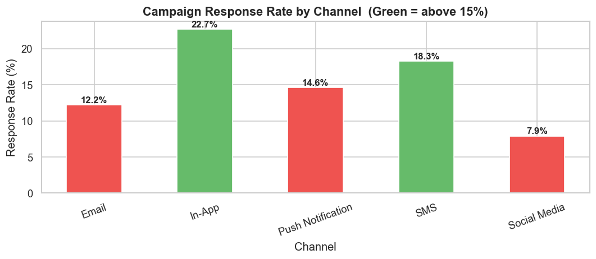 | 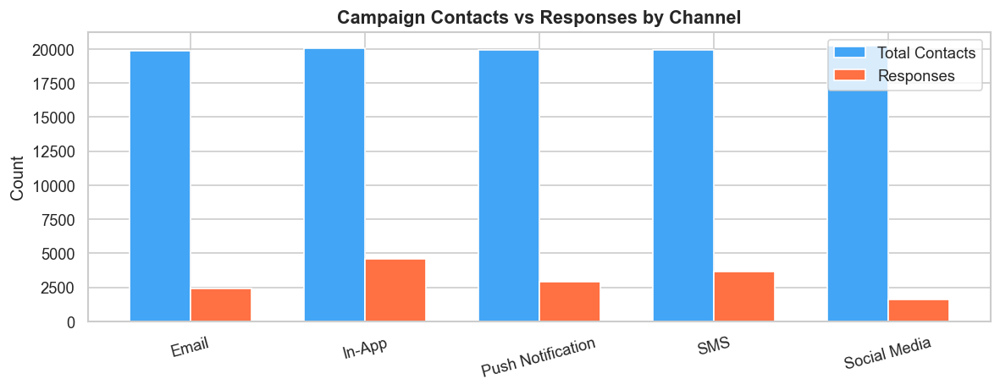 |

| Responses by Campaign |
|:---:|
| 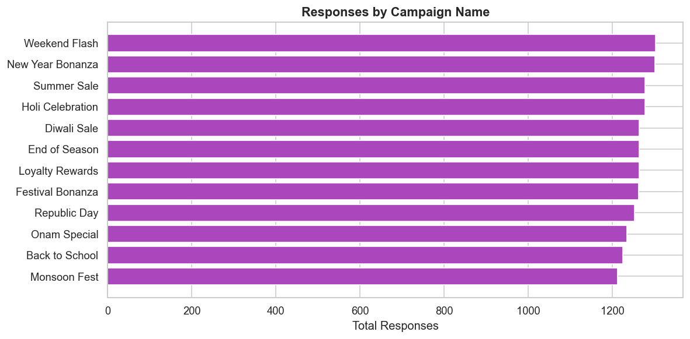 |

</div>

---

## 🎯 RFM Customer Segments

| Segment | Customers | Avg Spend | Revenue | Action |
|---|:---:|:---:|:---:|:---|
| 🔴 **At Risk** | 24,447 | ₹2.4L | ₹593 Cr | Win-back campaigns |
| 🟡 **Need Attention** | 17,575 | ₹1.3L | ₹235 Cr | Re-engagement offers |
| ⚫ **Lost Customers** | 4,950 | ₹70K | ₹34 Cr | Last-chance discount |
| 🟢 **Potential Loyalists** | 7 | ₹73.8L | ₹5.2 Cr | Loyalty program |
| 🥇 **Champions** | 1 | ₹2.86Cr | ₹2.9 Cr | VIP treatment |

> **Biggest opportunity:** Re-engaging 24,447 "At Risk" customers → recover up to **₹593 Cr** in revenue.

---

## 🏗️ Architecture

```
┌─────────────────────────────────────────────────────────┐
│              PYTHON ETL PIPELINE                        │
│   augment_to_scale.py → clean_*.py → run_pipeline.py   │
│   Data Quality: 100% retention, 0 nulls, 0 duplicates  │
└──────────────────────┬──────────────────────────────────┘
                       │
                       ▼
┌─────────────────────────────────────────────────────────┐
│           POSTGRESQL STAR SCHEMA (retail_analytics)     │
│                                                         │
│   dim_customer  dim_product  dim_store  dim_date        │
│              ↘       ↓       ↙                          │
│                 fact_sales                              │
│   fact_inventory         fact_marketing                 │
│   + 5 Analytical Views                                  │
└──────────┬───────────────────┬─────────────────────────┘
           │                   │
     ┌─────▼──────┐      ┌─────▼──────┐
     │ 31 SQL     │      │  Python    │
     │ Queries    │      │ RFM + CLV  │
     └─────┬──────┘      └─────┬──────┘
           └──────────┬────────┘
                      ▼
         ┌────────────────────────┐
         │  Excel  │  Power BI   │
         │ 6 Sheets│  6 Pages    │
         └────────────────────────┘
```

---

## 🛠️ Tech Stack

| Layer | Technology | Purpose |
|:---|:---:|:---|
| Language | Python 3.13 | ETL, EDA, analytics, automation |
| Data Wrangling | Pandas · NumPy | Cleaning, aggregation, segmentation |
| Visualisation | Matplotlib · Seaborn | 28 EDA charts |
| Excel Automation | openpyxl | 6-sheet workbook with charts |
| Database | PostgreSQL 17 | Star schema data warehouse |
| SQL | Standard SQL | JOINs, GROUP BY, HAVING, CASE |
| BI | Power BI Desktop | 6-page interactive dashboard |
| DAX | Basic DAX | SUM, DIVIDE, DISTINCTCOUNT, IF |
| Version Control | Git · GitHub | Source control |

---

## 📁 Project Structure

```
Retail-Consumer-Analytics/
│
├── 📄 README.md                ← You are here
├── 📄 SETUP.md                 ← Complete setup guide
├── 🚀 run_pipeline.py          ← Run all analytics
├── 🗄️  setup_database.py       ← One-command DB setup
│
├── 📂 screenshots/             ← All chart images (18)
│
├── 📂 data/processed/          ← Clean CSVs
│
├── 📂 python/
│   ├── 00_data_generation/     ← Data generation
│   ├── 02_data_cleaning/       ← 6 domain cleaners
│   ├── 03_eda/                 ← 5 EDA scripts → 28 charts
│   ├── 04_customer_analytics/  ← RFM + CLV
│   └── build_excel.py          ← Excel workbook
│
├── 📂 sql/                     ← 31 SQL scripts
│   ├── schema/                 ← Star schema DDL
│   ├── sales_analysis/         ← 9 scripts
│   ├── customer_analysis/      ← 6 scripts
│   ├── product_analysis/       ← 1 script
│   ├── inventory_analysis/     ← 2 scripts
│   └── marketing_analysis/     ← 2 scripts
│
├── 📂 excel/
│   └── Retail_Analysis.xlsx    ← 6-sheet workbook ✅
│
├── 📂 powerbi/
│   └── POWERBI_GUIDE.md        ← Dashboard guide
│
└── 📂 documentation/
    ├── insights.md             ← Real findings
    ├── recommendations.md
    └── data_dictionary.md
```

---

## ⚡ Quick Setup

```powershell
# 1. Clone
git clone https://github.com/Himansu123Nahak/Retail-Consumer-Analytics.git
cd Retail-Consumer-Analytics

# 2. Install dependencies
pip install -r requirements.txt

# 3. Run full analytics pipeline (EDA + RFM + CLV + Excel)
py run_pipeline.py
py python/build_excel.py

# 4. Setup PostgreSQL database
Copy-Item .env.example .env   # add DB_PASSWORD
py setup_database.py

# 5. Open Power BI → connect to retail_analytics
#    Follow: powerbi/POWERBI_GUIDE.md
```

Full guide: [`SETUP.md`](SETUP.md)

---

## 👤 Author

<div align="center">

**Himanshu Nahak**

Data Analyst · Python · SQL · Power BI · Excel

[](https://github.com/Himansu123Nahak)

---

⭐ *Star this repo if it helped you!* ⭐

</div>
